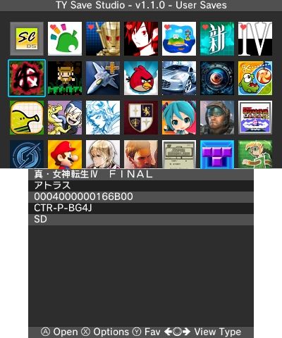

# TYSS for 3DS
TYSS or RYaTian's Save Studio for 3DS.

<h4 align="right">
  <a href="README_zh.md">简体中文</a> | English
</h4>

## Features
* Support backup/restore 3DS and DS cartridge saves
* Support save management for 3DS digital titles and demo titles, with automatic filtering of homebrew or other applications without save data
* Support backup/restore ExtData, BOSS ExtData, Sys Saves and Shared ExtData
* Support cloud save upload and download (via Google Drive)
* Support backup/restore DSiWare saves
* Support GBAVC save management (raw and/or .sav)
* Multi-language user interface
* Built-in cheats database (English and Simplified Chinese), with support for installing cheat files
* Save files can be compressed in zip format
* Provide both light and dark UI themes color
* Configurable game title language
* Provide Save Studio Toolbox for managing play time history, step history, cached icon data and more:
  * Modify play coin count
  * Clear step history
  * Clear play time history and software library
  * Clear shared icon cache
  * Clear HOME Menu icon cache (Old3DS consoles require `Mode3` version)
  * Reset demo play count
  * Clear game notes
  * Remove software update notifications
  * Unpack all gift-wrapped software on the HOME Menu
  * Modify today's step count
  * Reset favorites list and titles blacklist for TYSS

## Controls
* Circle Pad Left/Right, C-Stick Left Left/Right or ZL/ZR Changes View Type. Introduces L/R button function toggle, which allows Old 3DS users to switch View Type using the L/R buttons.
* While in title selection:
    * A Opens the highlighted title
	* Y Adds the highlighted title to favorites.
	* X Open options menu

* While Backup Item Selection is open:
    * A Overwrites an already dumped backup or selects New
	* X Deletes the highlighted item
	* Y Restores the highlighted item
	* R Upload the highlighted zip/sav/bin file
	* B Closes and returns to title selection

## Others
* **Google Drive Instructions:** Follow the guide [here](./GD_INSTRUCTIONS.MD).
	* NOTE: Cloud Drive feature requires backup created with the `Export To Zip` option turned on are uploadable.

## Download and Installation
**See [releases](https://github.com/R-YaTian/TYSS/releases) for the latest version.** 

## Building:
* Setup [devkitPro](https://www.3dbrew.org/wiki/Setting_up_Development_Environment)
* Run this command to install dependencies:
	* `dkp-pacman -S 3ds-curl 3ds-mbedtls 3ds-zlib` (You may need to remove `dkp`)
	* `pip install zopflipy` (You may need to install python and pip first)
	* Install `gettext` toolchain via your package manager
* Then simply run `make`

## License
Distributed under the GNU GPLv3. See [LICENSE](./LICENSE) for more information.

Copyright © 2024-2025 R-YaTian.

## Credits
* [R-YaTian](https://github.com/R-YaTian): Main Developer
* [J-D-K](https://github.com/J-D-K) for the original [JKSM](https://github.com/J-D-K/JKSM) version.
* [TuxSH](https://github.com/tuxsh) for [TWLSaveTool](https://github.com/TuxSH/TWLSaveTool), from which SPI code has been taken.
* All [Checkpoint](https://github.com/BernardoGiordano/Checkpoint) and [PKSM](https://github.com/FlagBrew/PKSM) contributors for some code that has been ported to TYSS.
* WinterMute, fincs and [devkitPro](https://devkitpro.org/) contributors for devkitARM and [dkp-pacman](https://github.com/devkitPro/pacman/releases).
* [James-Makoto](https://github.com/James-Makoto) for testing and the TYSS logo/icon.
* [FlagBrew](https://github.com/FlagBrew) for the original [Sharkive DB](https://github.com/FlagBrew/Sharkive).
* [realworld](https://github.com/realkkk): Main Translator of [Sharkive DB CHS](https://github.com/R-YaTian/Sharkive).
* [Ryuzaki-MrL](https://github.com/Ryuzaki-MrL) for the [Cthulhu](https://github.com/Ryuzaki-MrL/Cthulhu) homebrew.
