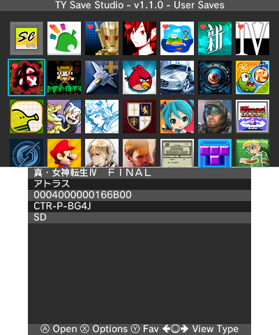

# TYSS for 3DS
TYSS - 天涯的3DS存档工作室

<h4 align="right">
  简体中文 | <a href="README.MD">English</a>
</h4>

## 功能特性
* 支持备份/恢复 3DS 和 DS 卡带存档
* 支持 3DS 数字版游戏和试玩版游戏的存档管理，自动过滤无存档数据的自制软件或其他应用程序
* 支持备份/恢复追加数据、BOSS追加数据、系统存档以及共享追加数据
* 支持云端存档上传和下载（通过阿里云盘或是自建 Google Drive）
* 支持备份/恢复 DSiWare 存档
* 支持 GBAVC 存档管理（raw 原始格式 或 .sav 格式）
* 多语言用户界面
* 内置金手指数据库（英文和简体中文），支持安装金手指文件
* 存档文件可压缩为 zip 格式
* 提供浅色和深色两种 UI 主题色彩
* 可配置游戏标题语言
* 提供存档工作室工具箱，用于管理游玩时间历史记录、步数历史记录、缓存图标数据等：
  * 修改游戏币数量
  * 清除步数历史记录
  * 清除游玩时间历史记录以及软件图鉴
  * 清除共享图标缓存
  * 清除主菜单图标缓存（老三需要使用 `Mode3` 版本）
  * 重置试玩版游戏试玩次数
  * 清除游戏笔记
  * 移除软件更新通知
  * 打开所有软件礼包
  * 修改今日步数
  * 重置 TYSS 的收藏列表以及黑名单列表

## 操作控制
* 操纵杆左/右、C摇杆左/右、ZL/ZR 切换视图类型。支持 L/R 按钮功能切换，允许老三用户使用 L/R 按钮切换视图类型
* 在标题选择界面时：
  * A 打开高亮的标题
  * Y 将高亮标题添加到收藏夹
  * X 打开选项菜单

* 当备份项目选择界面打开时：
  * A 覆盖已转储的备份或选择新建
  * X 删除高亮显示的项目
  * Y 恢复高亮显示的项目
  * R 上传高亮显示的 zip/sav/bin 文件
  * B 关闭并返回标题选择

## 云端存储
* **请前往[发布页面](https://github.com/R-YaTian/TYSS/releases)获取 `adrivehelper`，该实用程序将会调用浏览器导航至阿里云盘账号登录页，请登录后按照网页指示完成授权。**
* **自建 Google Drive 说明：** 请按照[此处](./GD_INSTRUCTIONS.MD)的指南操作(仅提供英文指南)。
* **注意：** 云端存储功能需要启用 `导出到 ZIP` 选项创建的备份才能上传。
* `adrivehelper` 实用程序的 `Windows` 版本使用 `VC-LTL5` 以及 `YY-Thunks` 进行构建, 以提高对旧版 Windows 的兼容性。(`Windows XP SP3` 下测试通过)

## 下载和安装
**请查看[发布页面](https://github.com/R-YaTian/TYSS/releases)获取最新版本。** 

## 编译构建:
* 安装 [devkitPro](https://www.3dbrew.org/wiki/Setting_up_Development_Environment)
* 运行以下命令安装依赖：
	* `dkp-pacman -S 3ds-curl 3ds-mbedtls 3ds-zlib` (根据操作系统的不同可能需要移除 `dkp`)
	* `pip install zopflipy` (如果没有 python 和 pip, 请先安装)
	* 使用任意包管理器安装 `gettext` 工具链
  * 执行 `git clone -b 3ds-jtjson https://github.com/R-YaTian/3ds-jtjson.git && cd 3ds-jtjson && catnip -T 3ds -S . -B build install`
* 直接执行 `make`

## 许可证
**根据 GNU GPLv3 许可证分发。 打开 [LICENSE](./LICENSE) 查看更多内容。**

**Copyright © 2024-2025 R-YaTian.**

## 致谢
* [R-YaTian](https://github.com/R-YaTian)：主要开发者，项目所有者
* [J-D-K](https://github.com/J-D-K) 提供原始的 [JKSM](https://github.com/J-D-K/JKSM) 版本
* [TuxSH](https://github.com/tuxsh) 提供 [TWLSaveTool](https://github.com/TuxSH/TWLSaveTool)，从中获取了 SPI 相关代码
* 所有 [Checkpoint](https://github.com/BernardoGiordano/Checkpoint) 和 [PKSM](https://github.com/FlagBrew/PKSM) 贡献者，某些代码实现已移植到 TYSS
* WinterMute、fincs 和 [devkitPro](https://devkitpro.org/) 贡献者提供 devkitARM 和 [dkp-pacman](https://github.com/devkitPro/pacman/releases)
* [Forget](https://github.com/James-Makoto) 进行测试并制作 TYSS 标志/图标
* [FlagBrew](https://github.com/FlagBrew) 提供原始的 [Sharkive 金手指数据库](https://github.com/FlagBrew/Sharkive)
* [天地人](https://github.com/realkkk)：[Sharkive 简中金手指数据库](https://github.com/R-YaTian/Sharkive) 主要翻译者
* [Ryuzaki-MrL](https://github.com/Ryuzaki-MrL) 提供 [Cthulhu](https://github.com/Ryuzaki-MrL/Cthulhu) 自制软件
